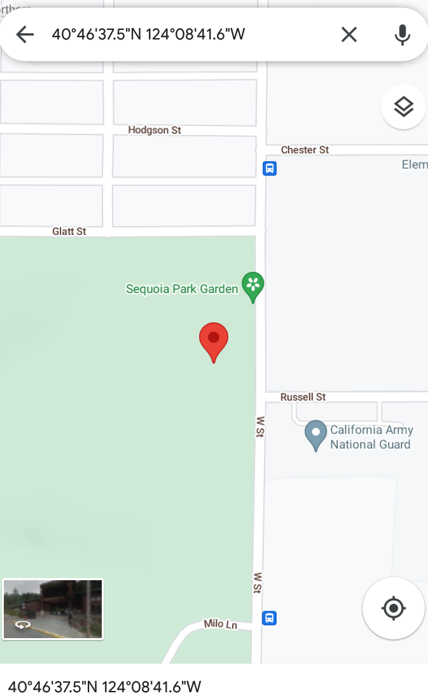

# Java-Assignment-003
### Input, Packages, Imports, and a static Method
## PART 1 - Build an External Package
1. Watch the below linked video, and follow along on how we build a **Java Archive** artifact (**jar**) from a GitHub project.
[Jar file build from GitHub Project](https://pdx.nv.instructuremedia.com/fetch/QkFoYkIxc0hhUVRKb0U0RGFRUmRkUVFDYkNzSG9QNFVZdz09LS1hYTBhODRlOWU5NTdkMzljZDU4ZThiM2Y1N2RmNDZhMmI4NGUxMmM0.mp4)
1. If you didn't already, attempt to build the artifact, **the jar file** yourself!
[MetaData Extractor Code on GitHub](https://github.com/drewnoakes/metadata-extractor)
1. Watch the below linked video, and follow along to import an external **jar** file into your project!
[Import External Jar into your Project](https://pdx.nv.instructuremedia.com/fetch/QkFoYkIxc0hhUVM0b1U0RGFRVGJkUVFDYkNzSEJmOFVZdz09LS0yYWY5NmMwYzM2MDA0ZGY5YTAzNTQ0NjM0ZTNmYWI2NTk4ZGMyYjRk.mp4)
1. If your artifact creation step was successful, see if you can import your build of the metadata jar file into Java-Assignment-003 after you start PART 2 below!

## PART 2 - Implementation
Just like you do every week now!!!
* Fork my repo
* Using IntelliJ clone your fork locally
* Use IntelliJ to activate the Fall-2022 local branch
* Implement the following assignment:

Your assignment is to use Built-In java classes to:

1. Import the following java Built-In classes.
```
java.nio.file.Paths;
java.util.Scanner;
java.nio.file.Path;
```
1. Read a **jpg file path** from the user.
     * HINT 1: Create a **Scanner** object instance and use it to read a string.
     * HINT 2: Use **Paths** class to get a path from your input!
1. From your path object call a **method** that converts the file path to a **File** type object (**Cause that's what getHiddenSecret declares as its parameters**).
1. Pass the file object as an argument to the pre-written **getHiddenSecrets** method.
1. Run the program and type in the path for our sample image, and record the GPS coordinates in the output.
  
    * HINT: the path can be relative to the project directory, maybe use the string in the example above :-)
1. Look up the latitude and longitude coordinates in an online map.
1. Screenshot the map and add it into the **images** folder of this project,
1. Last add image markdown below this line to load your map image.
   

## PART 3 - Code Scanning and Interpretation
* Look at the getHiddenSecrets method and identify the following parts:
    * What is the access modifer (public, private, protected)?
      * Public
    * Is it a Class method or an object Instance method, how do you know?
      * It's a Class method. I know this because it says Static which allows the main() method to be called before any objects of the class have been created.
    * What is its return data-type?
      * Void
    * Does it require any parameters, and if so, how many and of what type?
      * File, file, 2
* Scan line by line through the code and try to determine how it works?
    * What is familiar to you?
      * The class and method headers and the format specifiers and the metadata variable and the souts.
    * What is not familiar to you?
      * if, for, try, catch, all the error statements.
    * Do the **for** loops make sense, and if so, tell me what you think they do?
        *It seems like the for loops are asking to display metadata directory information once, and then asking for tags, names, and descriptions to be pulled. A for loop is also asking for an error message if there is an error in the directory.
## PART 4 - Turn in
### Same as the last 2 Weeks!
* When completed, use your IDE to commit your Fall-2022 branch back to your GitHub Account's, Java-Assignment-003/Fall-2022 repo/branch.
* From your GitHub account's branch's page, issue a New pull request from your *Fall-2022* branch to the instructor's *Fall-2022* branch and save the *Pull Request URL*.
* Respond to this assignment with the Pull Request URL.
